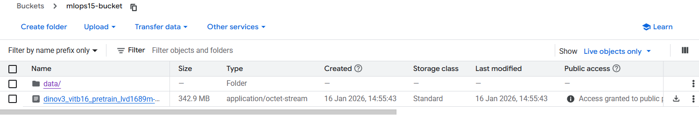
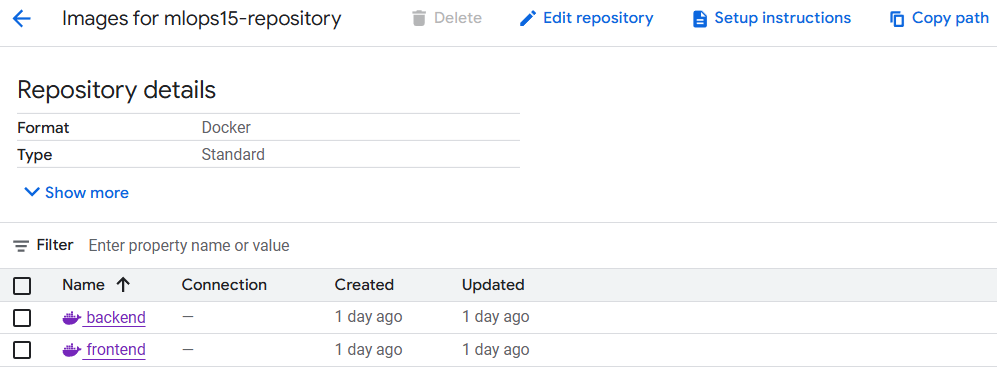
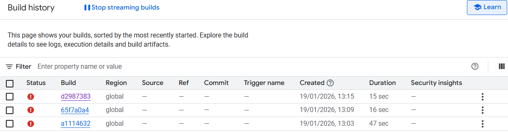
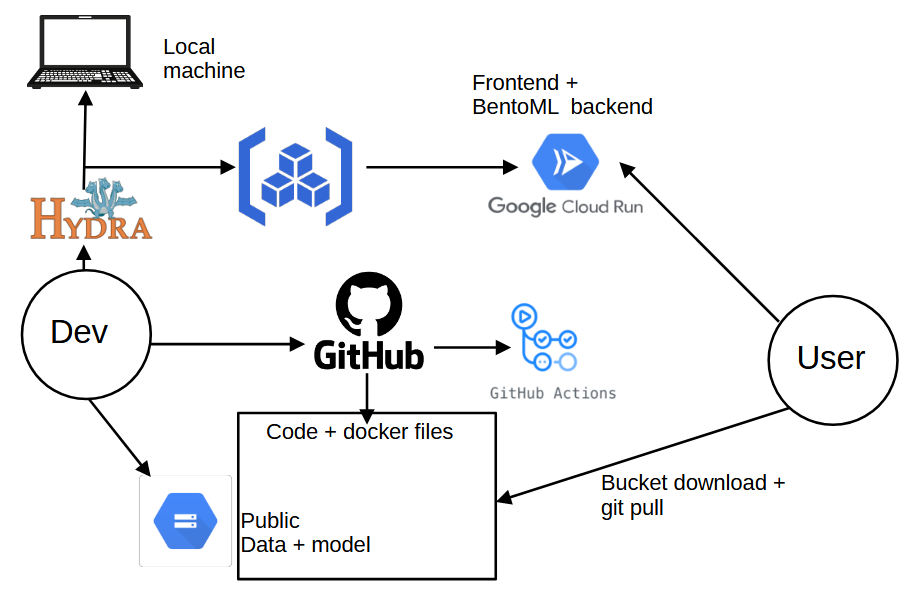

# Exam template for 02476 Machine Learning Operations

This is the report template for the exam. Please only remove the text formatted as with three dashes in front and behind
like:

```--- question 1 fill here ---```

Where you instead should add your answers. Any other changes may have unwanted consequences when your report is
auto-generated at the end of the course. For questions where you are asked to include images, start by adding the image
to the `figures` subfolder (please only use `.png`, `.jpg` or `.jpeg`) and then add the following code in your answer:

``

In addition to this markdown file, we also provide the `report.py` script that provides two utility functions:

Running:

```bash
python report.py html
```

Will generate a `.html` page of your report. After the deadline for answering this template, we will auto-scrape
everything in this `reports` folder and then use this utility to generate a `.html` page that will be your serve
as your final hand-in.

Running

```bash
python report.py check
```

Will check your answers in this template against the constraints listed for each question e.g. is your answer too
short, too long, or have you included an image when asked. For both functions to work you mustn't rename anything.
The script has two dependencies that can be installed with

```bash
pip install typer markdown
```

or

```bash
uv add typer markdown
```

## Overall project checklist

The checklist is *exhaustive* which means that it includes everything that you could do on the project included in the
curriculum in this course. Therefore, we do not expect at all that you have checked all boxes at the end of the project.
The parenthesis at the end indicates what module the bullet point is related to. Please be honest in your answers, we
will check the repositories and the code to verify your answers.

### Week 1

* [x] Create a git repository (M5)
* [x] Make sure that all team members have write access to the GitHub repository (M5)
* [x] Create a dedicated environment for you project to keep track of your packages (M2)
* [x] Create the initial file structure using cookiecutter with an appropriate template (M6)
* [x] Fill out the `data.py` file such that it downloads whatever data you need and preprocesses it (if necessary) (M6)
* [x] Add a model to `model.py` and a training procedure to `train.py` and get that running (M6)
* [x] Remember to either fill out the `requirements.txt`/`requirements_dev.txt` files or keeping your
    `pyproject.toml`/`uv.lock` up-to-date with whatever dependencies that you are using (M2+M6)
* [ ] Remember to comply with good coding practices (`pep8`) while doing the project (M7)
* [ ] Do a bit of code typing and remember to document essential parts of your code (M7)
* [ ] Setup version control for your data or part of your data (M8)
* [x] Add command line interfaces and project commands to your code where it makes sense (M9)
* [x] Construct one or multiple docker files for your code (M10)
* [x] Build the docker files locally and make sure they work as intended (M10)
* [x] Write one or multiple configurations files for your experiments (M11)
* [x] Used Hydra to load the configurations and manage your hyperparameters (M11)
* [x] Use profiling to optimize your code (M12)
* [ ] Use logging to log important events in your code (M14)
* [ ] Use Weights & Biases to log training progress and other important metrics/artifacts in your code (M14)
* [ ] Consider running a hyperparameter optimization sweep (M14)
* [ ] Use PyTorch-lightning (if applicable) to reduce the amount of boilerplate in your code (M15)

### Week 2

* [x] Write unit tests related to the data part of your code (M16)
* [x] Write unit tests related to model construction and or model training (M16)
* [x] Calculate the code coverage (M16)
* [x] Get some continuous integration running on the GitHub repository (M17)
* [ ] Add caching and multi-os/python/pytorch testing to your continuous integration (M17)
* [ ] Add a linting step to your continuous integration (M17)
* [ ] Add pre-commit hooks to your version control setup (M18)
* [ ] Add a continues workflow that triggers when data changes (M19)
* [ ] Add a continues workflow that triggers when changes to the model registry is made (M19)
* [ ] Create a data storage in GCP Bucket for your data and link this with your data version control setup (M21)
* [ ] Create a trigger workflow for automatically building your docker images (M21)
* [x] Get your model training in GCP using either the Engine or Vertex AI (M21)
* [x] Create a FastAPI application that can do inference using your model (M22)
* [x] Deploy your model in GCP using either Functions or Run as the backend (M23)
* [x] Write API tests for your application and setup continues integration for these (M24)
* [x] Load test your application (M24)
* [x] Create a more specialized ML-deployment API using either ONNX or BentoML, or both (M25)
* [x] Create a frontend for your API (M26)

### Week 3

* [x] Check how robust your model is towards data drifting (M27)
* [x] Setup collection of input-output data from your deployed application (M27)
* [ ] Deploy to the cloud a drift detection API (M27)
* [ ] Instrument your API with a couple of system metrics (M28)
* [x] Setup cloud monitoring of your instrumented application (M28)
* [x] Create one or more alert systems in GCP to alert you if your app is not behaving correctly (M28)
* [x] If applicable, optimize the performance of your data loading using distributed data loading (M29)
* [ ] If applicable, optimize the performance of your training pipeline by using distributed training (M30)
* [ ] Play around with quantization, compilation and pruning for you trained models to increase inference speed (M31)

### Extra

* [ ] Write some documentation for your application (M32)
* [ ] Publish the documentation to GitHub Pages (M32)
* [x] Revisit your initial project description. Did the project turn out as you wanted?
* [x] Create an architectural diagram over your MLOps pipeline
* [x] Make sure all group members have an understanding about all parts of the project
* [x] Uploaded all your code to GitHub

## Group information

### Question 1
> **Enter the group number you signed up on <learn.inside.dtu.dk>**
>
> Answer:

15

### Question 2
> **Enter the study number for each member in the group**
>
> Example:
>
> *sXXXXXX, sXXXXXX, sXXXXXX*
>
> Answer:

s204746, s253047, s253080, s254145

### Question 3
> **Did you end up using any open-source frameworks/packages not covered in the course during your project? If so**
> **which did you use and how did they help you complete the project?**
>
> Recommended answer length: 0-200 words.
>
> Example:
> *We used the third-party framework ... in our project. We used functionality ... and functionality ... from the*
> *package to do ... and ... in our project*.
>
> Answer:

Yes: instead of using Typer for the command-line interface, we chose to use argparse, which is part of Python’s standard library.
We made this choice because we were already familiar with argparse, which allowed us to implement the required command-line arguments quickly and reliably.

## Coding environment

> In the following section we are interested in learning more about you local development environment. This includes
> how you managed dependencies, the structure of your code and how you managed code quality.

### Question 4

> **Explain how you managed dependencies in your project? Explain the process a new team member would have to go**
> **through to get an exact copy of your environment.**
>
> Recommended answer length: 100-200 words
>
> Example:
> *We used ... for managing our dependencies. The list of dependencies was auto-generated using ... . To get a*
> *complete copy of our development environment, one would have to run the following commands*
>
> Answer:

We managed our project dependencies using uv, leveraging the pyproject.toml file along with the corresponding lock file (uv.lock) to explicitly define all required packages and their versions. The virtual environment itself is not versioned and is included in .gitignore to avoid unnecessary files in the repository. This setup ensures reproducibility: any new team member only needs to have Python and uv installed. After cloning the repository, they can create and activate a local virtual environment and run uv sync. This command installs the exact versions of all dependencies as specified in the lock file, guaranteeing a consistent and fully reproducible development environment across all machines.

For downloading the dataset and model from GCP Bucket, we can use the setup.sh file with the following commands:

chmod +x setup.sh

./setup.sh

### Question 5

> **We expect that you initialized your project using the cookiecutter template. Explain the overall structure of your**
> **code. What did you fill out? Did you deviate from the template in some way?**
>
> Recommended answer length: 100-200 words
>
> Example:
> *From the cookiecutter template we have filled out the ... , ... and ... folder. We have removed the ... folder*
> *because we did not use any ... in our project. We have added an ... folder that contains ... for running our*
> *experiments.*
>
> Answer:

From the cookiecutter template we have filled out almost every folder execpt notebook and devcontainer. In src/anomaly_detection/ we've added a layers folder that contains code scraped from the DINOv3 github repo that we need to run our model, a hydra folder for our hydra experiments and an api folder that contains both fastAPI and bentoml backends as well as the frontend script. In the models folder we save the weights of our model, the memory bank generated by train.py and an onnx version of our model.

### Question 6

> **Did you implement any rules for code quality and format? What about typing and documentation? Additionally,**
> **explain with your own words why these concepts matters in larger projects.**
>
> Recommended answer length: 100-200 words.
>
> Example:
> *We used ... for linting and ... for formatting. We also used ... for typing and ... for documentation. These*
> *concepts are important in larger projects because ... . For example, typing ...*
>
> Answer:

We used ruff for linting and the Black Formatter VScode extension to perform auto formatting when saving a python script. We also used Copilot auto suggestion feature to correct the code as we were coding. For documentation, we included clear docstrings as well commentaries for all critical functions to explain logic and wrote a documentation file index.md explaining how to use the different scripts and features of our project.
For larger projects, these concepts are essential for scalability and collaboration. Consistent formatting prevents style conflicts, while static typing and documentation reduce cognitive load. This acts as a contract between components, making it significantly easier for new developers to onboard and preventing bugs when the codebase grows complexity.

## Version control

> In the following section we are interested in how version control was used in your project during development to
> corporate and increase the quality of your code.

### Question 7

> **How many tests did you implement and what are they testing in your code?**
>
> Recommended answer length: 50-100 words.
>
> Example:
> *In total we have implemented X tests. Primarily we are testing ... and ... as these the most critical parts of our*
> *application but also ... .*
>
> Answer:

In total, we implemented 34 tests covering unit logic, integration pipelines, and system load. We implemented tests for data.py, model.py, train.py, inference.py, evaluate.py and api.py. We primarily validated critical model behaviors, such as tensor shapes and memory bank normalization, while using unittest.mock to patch heavy dependencies like DINOv3 to avoid loading the model when testing training or inference. Additionally, we ensured system robustness by testing edge cases, such as missing ground truth masks or GPU unavailability, and verified the API's stability through Locust load testing.

### Question 8

> **What is the total code coverage (in percentage) of your code? If your code had a code coverage of 100% (or close**
> **to), would you still trust it to be error free? Explain you reasoning.**
>
> Recommended answer length: 100-200 words.
>
> Example:
> *The total code coverage of code is X%, which includes all our source code. We are far from 100% coverage of our **
> *code and even if we were then...*
>
> Answer:

The total code coverage of our code is 79% (this only takes into account python scripts for which we wrote tests), which includes most of our source code. We didn't implemented tests for service.py which is the bentoml backend of the api, the hydra files, code from the DINOv3 repo, export_onnx_paranoid and data_drift_demo.py. We tried to have good code coverage for the most important scripts of our project. Among the tested scripts, the coverage is 78% for data.py, 69% for evaluate.py, 74% for inference.py, 99% for model.py, 95% for train.py.

### Question 9

> **Did you workflow include using branches and pull requests? If yes, explain how. If not, explain how branches and**
> **pull request can help improve version control.**
>
> Recommended answer length: 100-200 words.
>
> Example:
> *We made use of both branches and PRs in our project. In our group, each member had an branch that they worked on in*
> *addition to the main branch. To merge code we ...*
>
> Answer:

We used branches but not PR in our project. In our group, each member had at least one branch that was kept up to date with main using merge and they were used to work on new features without disturbing others. Once someone had a feature working they went back to main and merged their branch. Then, they could go back to their branch, updating it by merging main and continue working.

### Question 10

> **Did you use DVC for managing data in your project? If yes, then how did it improve your project to have version**
> **control of your data. If no, explain a case where it would be beneficial to have version control of your data.**
>
> Recommended answer length: 100-200 words.
>
> Example:
> *We did make use of DVC in the following way: ... . In the end it helped us in ... for controlling ... part of our*
> *pipeline*
>
> Answer:

We did not use DVC in this project. Incorporating DVC would have been highly beneficial, as it allows for versioning and tracking changes in our dataset over time. This would have been especially useful if we applied data augmentation techniques or needed to test our model on new images, ensuring that all modifications are recorded and reproducible. By using DVC, the team could easily go back to previous dataset versions, compare results across experiments, and maintain a clear history of how the data evolved. Overall, it provides better reproducibility and traceability in the workflow, which is essential for collaborative projects in general.

### Question 11

> **Discuss you continuous integration setup. What kind of continuous integration are you running (unittesting,**
> **linting, etc.)? Do you test multiple operating systems, Python  version etc. Do you make use of caching? Feel free**
> **to insert a link to one of your GitHub actions workflow.**
>
> Recommended answer length: 200-300 words.
>
> Example:
> *We have organized our continuous integration into 3 separate files: one for doing ..., one for running ... testing*
> *and one for running ... . In particular for our ..., we used ... .An example of a triggered workflow can be seen*
> *here: <weblink>*
>
> Answer:

--- question 11 fill here ---

## Running code and tracking experiments

> In the following section we are interested in learning more about the experimental setup for running your code and
> especially the reproducibility of your experiments.

### Question 12

> **How did you configure experiments? Did you make use of config files? Explain with coding examples of how you would**
> **run a experiment.**
>
> Recommended answer length: 50-100 words.
>
> Example:
> *We used a simple argparser, that worked in the following way: Python  my_script.py --lr 1e-3 --batch_size 25*
>
> Answer:

--- question 12 fill here ---

### Question 13

> **Reproducibility of experiments are important. Related to the last question, how did you secure that no information**
> **is lost when running experiments and that your experiments are reproducible?**
>
> Recommended answer length: 100-200 words.
>
> Example:
> *We made use of config files. Whenever an experiment is run the following happens: ... . To reproduce an experiment*
> *one would have to do ...*
>
> Answer:

--- question 13 fill here ---

### Question 14

> **Upload 1 to 3 screenshots that show the experiments that you have done in W&B (or another experiment tracking**
> **service of your choice). This may include loss graphs, logged images, hyperparameter sweeps etc. You can take**
> **inspiration from [this figure](figures/wandb.png). Explain what metrics you are tracking and why they are**
> **important.**
>
> Recommended answer length: 200-300 words + 1 to 3 screenshots.
>
> Example:
> *As seen in the first image when have tracked ... and ... which both inform us about ... in our experiments.*
> *As seen in the second image we are also tracking ... and ...*
>
> Answer:

--- question 14 fill here ---

### Question 15

> **Docker is an important tool for creating containerized applications. Explain how you used docker in your**
> **experiments/project? Include how you would run your docker images and include a link to one of your docker files.**
>
> Recommended answer length: 100-200 words.
>
> Example:
> *For our project we developed several images: one for training, inference and deployment. For example to run the*
> *training docker image: `docker run trainer:latest lr=1e-3 batch_size=64`. Link to docker file: <weblink>*
>
> Answer:

Docker was used in our project to ensure reproducibility across different environments, from local development to cloud deployment (the images being saved in the artifact registry then used in either a VM with Engine or a Run service). We created container images for data loading, creating the memory bank and evaluation. We also have docker images for both the frontend application and the backend inference service. The backend image packages the machine learning model and its dependencies and is built using a BentoML-based setup. The frontend image contains the user interface and handles user interactions such as image uploads and request forwarding to the backend.

Each Docker image includes all required dependencies defined in the project configuration, ensuring that the application runs identically regardless of the host system. Locally, the containers can be run using standard Docker commands, for example:

docker run --name evaluate1   -v ~/MLOPs_Project/data:/app/data   -v ~/MLOPs_Project/models:/app/models   -v ~/MLOPs_Project/results:/app/results   evaluation:latest   --data_root ./data   --class_name carpet   --weights_path ./models/dinov3_vitb16_pretrain_lvd1689m-73cec8be.pth   --memory_bank_path ./models/memory_bank.pt   --output_dir ./results/figures

to start the evaluation.

The same images were pushed to the artifact registry and deployed on Google Cloud Run, allowing an efficient deployment. One of the Dockerfiles used in the project can be found here:

https://github.com/Kxlar/MLOPs_Project/blob/main/dockerfiles/evaluation.dockerfile

### Question 16

> **When running into bugs while trying to run your experiments, how did you perform debugging? Additionally, did you**
> **try to profile your code or do you think it is already perfect?**
>
> Recommended answer length: 100-200 words.
>
> Example:
> *Debugging method was dependent on group member. Some just used ... and others used ... . We did a single profiling*
> *run of our main code at some point that showed ...*
>
> Answer:

--- question 16 fill here ---

## Working in the cloud

> In the following section we would like to know more about your experience when developing in the cloud.

### Question 17

> **List all the GCP services that you made use of in your project and shortly explain what each service does?**
>
> Recommended answer length: 50-200 words.
>
> Example:
> *We used the following two services: Engine and Bucket. Engine is used for... and Bucket is used for...*
>
> Answer:

We used:
Engine for constructing the memory bank used by our model,
Bucket for storing data and the pretrained model and making those accessible online,
Artifact registry for saving our docker images and deploying them with cloud run,
Cloud run for deploying our APIs and for its metrics and monitoring/alert features.


### Question 18

> **The backbone of GCP is the Compute engine. Explained how you made use of this service and what type of VMs**
> **you used?**
>
> Recommended answer length: 100-200 words.
>
> Example:
> *We used the compute engine to run our ... . We used instances with the following hardware: ... and we started the*
> *using a custom container: ...*
>
> Answer:

The Compute Engine was used to build the memory bank for our project. We experimented with constructing several virtual machines using different hardware configurations, exploring available accelerators and attempting to set up CUDA for GPU support. After testing, we decided to use a CPU-based VM with machine type e2-medium (2 vCPUs and 4 GB memory), as this configuration was sufficient for our needs and simple to set up. On this VM, we cloned our Git repository, downloaded the required data and pretrained model, and executed our code within a custom Docker container. This setup allowed us to maintain a controlled and reproducible environment while efficiently building the memory bank.

### Question 19

> **Insert 1-2 images of your GCP bucket, such that we can see what data you have stored in it.**
> **You can take inspiration from [this figure](figures/bucket.png).**
>
> Answer:

Bucket screenshot:

[](figures/bucket.png)

We stored our dataset and pretrained model in the bucket.

### Question 20

> **Upload 1-2 images of your GCP artifact registry, such that we can see the different docker images that you have**
> **stored. You can take inspiration from [this figure](figures/registry.png).**
>
> Answer:

Registry screenshot:

[](figures/registry.png)

We stored our different images for the backend and frontend of our application.

### Question 21

> **Upload 1-2 images of your GCP cloud build history, so we can see the history of the images that have been build in**
> **your project. You can take inspiration from [this figure](figures/build.png).**
>
> Answer:

Build screenshot:

[](figures/build.png)

There is not much to see as the images that we succesfully used were built locally and pushed into the repository. In particular, we did not use triggers to build images automatically as we encountered issues with github permissions and some errors the github repo's owner tried enabling .

### Question 22

> **Did you manage to train your model in the cloud using either the Engine or Vertex AI? If yes, explain how you did**
> **it. If not, describe why.**
>
> Recommended answer length: 100-200 words.
>
> Example:
> *We managed to train our model in the cloud using the Engine. We did this by ... . The reason we choose the Engine*
> *was because ...*
>
> Answer:

We managed to build the memory bank required by our model using the Compute Engine. Although it would have been possible to construct it locally, using the cloud engine provided access to more powerful hardware and allowed us to better manage resources. This approach is particularly useful for larger datasets or more computationally demanding tasks, as it gives flexibility to experiment with different machine types and configurations. By using the cloud, we could ensure that the process was reproducible and isolated, while also enabling easier collaboration among team members who may not have equivalent local hardware. Overall, this setup provided a reliable and scalable environment for building the memory bank.


## Deployment

### Question 23

> **Did you manage to write an API for your model? If yes, explain how you did it and if you did anything special. If**
> **not, explain how you would do it.**
>
> Recommended answer length: 100-200 words.
>
> Example:
> *We did manage to write an API for our model. We used FastAPI to do this. We did this by ... . We also added ...*
> *to the API to make it more ...*
>
> Answer:

We managed to write 2 API for our model. First we used FastAPI as a first version of the backend of our app to do inference with: taking a .png file from a user and running our model. Then we implemented a bentoML version of the API as a replacement for FastAPI. Both backends uses a conversion of the infered image to a string in base64 to be more efficient. Our model relies on a memory_bank.pt file to run so in case this file doesn't exist our API is able to run train.py to build a memory_bank from scratch ensuring that the API won't crash.

### Question 24

> **Did you manage to deploy your API, either in locally or cloud? If not, describe why. If yes, describe how and**
> **preferably how you invoke your deployed service?**
>
> Recommended answer length: 100-200 words.
>
> Example:
> *For deployment we wrapped our model into application using ... . We first tried locally serving the model, which*
> *worked. Afterwards we deployed it in the cloud, using ... . To invoke the service an user would call*
> *`curl -X POST -F "file=@file.json"<weburl>`*
>
> Answer:

We succesfully deployed both FastAPI and bentoML locally and containerized them into docker container: backend.dockerfile for FastAPI, for bentoML we built a bento then containerized it into an auto docker build. Afterwards we implemented a frontend for the API and deployed it in the cloud using two different services on GCP: one for backend (bentoML) and one for frontend. Our app is available at https://frontend-445436263618.europe-west1.run.app/. To use the service we call api_inference.py so a user would use *'uv run src/anomaly_detection/API/api_inference.py --image_path --host --port'* and the infered image is shown using matplotlib.

### Question 25

> **Did you perform any unit testing and load testing of your API? If yes, explain how you did it and what results for**
> **the load testing did you get. If not, explain how you would do it.**
>
> Recommended answer length: 100-200 words.
>
> Example:
> *For unit testing we used ... and for load testing we used ... . The results of the load testing showed that ...*
> *before the service crashed.*
>
> Answer:

For unit testing we used FastAPI's TestClient and to keep the tests focused on logic we used patch from unittest.mock to avoid loading our actual model. For load testing we used Locust to simulate user traffic. Our HttpUser class continuously sends POST requests to the inference endpoint with wait times simulated between 1s and 5s. For our FastAPI, over 78 users, we observed a median response time of 3800ms and a spike of 7400ms at the 95th percentile. For our bentoml api, over 89 users, we've got a similar median and a peak at 4400ms. These high latencies indicate that while the service is stable, the current CPU-based inference is a bottleneck, also the adaptative batching from bentoml proved to be very efficient, almost reducing by half the peak latency.

### Question 26

> **Did you manage to implement monitoring of your deployed model? If yes, explain how it works. If not, explain how**
> **monitoring would help the longevity of your application.**
>
> Recommended answer length: 100-200 words.
>
> Example:
> *We did not manage to implement monitoring. We would like to have monitoring implemented such that over time we could*
> *measure ... and ... that would inform us about this ... behaviour of our application.*
>
> Answer:

We used the Cloud Run SLOs feature to monitor both our frontend and backend services effectively. For the frontend, we tracked an availability metric, ensuring that the service remained responsive and accessible to users. For the backend, we monitored a latency metric, which allowed us to detect delays in processing requests or serving predictions. Based on these metrics, we created alerts that are automatically triggered whenever the defined thresholds are reached. This setup ensures that any performance degradation or downtime is immediately flagged, enabling the team to quickly respond and maintain the reliability and stability of the deployed application on Cloud Run.

## Overall discussion of project

> In the following section we would like you to think about the general structure of your project.

### Question 27

> **How many credits did you end up using during the project and what service was most expensive? In general what do**
> **you think about working in the cloud?**
>
> Recommended answer length: 100-200 words.
>
> Example:
> *Group member 1 used ..., Group member 2 used ..., in total ... credits was spend during development. The service*
> *costing the most was ... due to ... . Working in the cloud was ...*
>
> Answer:

Group member s253047 used about 14% of the 50$, which represents 7.32$. The most expensive service was by far the compute engine (6.77$) probably due to the use of hardware during several experiments, then Cloud Run (0.47$), then others.
The Cloud tasks were almost exclusively done using this google account so this basically represents the cost of the project.

We believe Cloud can be useful to benefit form Google's ressources, to work with data version control and to deploy an API online easily, also it seems relatively cheap. But depending on a remote service is a bit frustrating, and is probably an issue when working with confidential data.

### Question 28

> **Did you implement anything extra in your project that is not covered by other questions? Maybe you implemented**
> **a frontend for your API, use extra version control features, a drift detection service, a kubernetes cluster etc.**
> **If yes, explain what you did and why.**
>
> Recommended answer length: 0-200 words.
>
> Example:
> *We implemented a frontend for our API. We did this because we wanted to show the user ... . The frontend was*
> *implemented using ...*
>
> Answer:

We implemeted a frontend for our API because we felt like it was nice to have a complete website to interact with. The frontend was implemented using streamlit and consists of one main page where the user can upload their image for anomaly detection and then once the image is selected, the infered heatmap is displayed. We also implemented a data drifting demo consisting of a docker image that automatically apply data augmentation to simulate data drifting, then performs inference on the old memory bank and the updated one, and evaluate both infered datasets to show 2 histograms showing how separable the drifted data are.

### Question 29

> **Include a figure that describes the overall architecture of your system and what services that you make use of.**
> **You can take inspiration from [this figure](figures/overview.png). Additionally, in your own words, explain the**
> **overall steps in figure.**
>
> Recommended answer length: 200-400 words
>
> Example:
>
> *The starting point of the diagram is our local setup, where we integrated ... and ... and ... into our code.*
> *Whenever we commit code and push to GitHub, it auto triggers ... and ... . From there the diagram shows ...*
>
> Answer:

[](figures/overview.png)

The system architecture depicted in the figure illustrates the end-to-end workflow for model development, deployment, and user access. The process begins with the developer's local machine, where coding, experimentation, and initial model testing occur. To manage experiments efficiently, we integrate Hydra, which enables reproducibility and easy configuration of experiments. Once experiments are complete, the developer pushes both code and configuration files to GitHub, which acts as the central repository for version control.
In parallel, the data and trained model are stored in a cloud storage bucket. This ensures that large datasets and model weights are accessible both to automated pipelines and end users (publicly), without the need for local downloads each time. The combination of code in GitHub and public data in the bucket forms the foundation for deployment.
When code is pushed to GitHub, it triggers GitHub Actions workflows, which automate tasks like running tests, or automated linting and formatting (pre commit). Cloud Run hosts both the frontend interface and the BentoML backend, allowing the model to be served as an API and providing a user-friendly interface.
Finally, users can interact with the deployed service through the online frontend or locally: users can download the data and models from the cloud bucket and keep their local copies up to date via git pull, enabling offline experimentation or further development.
Overall, this architecture provides a seamless pipeline from local development and experiment management to user access,


### Question 30

> **Discuss the overall struggles of the project. Where did you spend most time and what did you do to overcome these**
> **challenges?**
>
> Recommended answer length: 200-400 words.
>
> Example:
> *The biggest challenges in the project was using ... tool to do ... . The reason for this was ...*
>
> Answer:

We had a few issues with conflicting virtual environment and repositories as we were not used to work with uv and specific template tools like cookiecutter. The difficulties were due to some bad project management such as having a project into an other (locally) but we managed cleaning up everything and using our .toml to manage our environments.

Also we struggled with the Cloud as it was new to us, but the course's explanations in addition to some research online, the use of LLMs and discussions on Slack helped us solve most of our issues.
We might still struggle a bit if we need to use a specific python version/pytorch/GPU configuration in a VM with Engine.
We had some issues with Cloud Run as well, when trying to deploy some services as we ran into errors when bad port management or insufficiant ressources. The error message was not very explicit, which made things hard to fix. this specific problem was documented in the course so this seems to be common. In general, error in the Cloud were difficult to understand.

Finally, we worked on our github management skills, encountering some issues with merging conflicts and authorizations, but some research online or using LLMs always helped us solving problems.

### Question 31

> **State the individual contributions of each team member. This is required information from DTU, because we need to**
> **make sure all members contributed actively to the project. Additionally, state if/how you have used generative AI**
> **tools in your project.**
>
> Recommended answer length: 50-300 words.
>
> Example:
> *Student sXXXXXX was in charge of developing of setting up the initial cookie cutter project and developing of the*
> *docker containers for training our applications.*
> *Student sXXXXXX was in charge of training our models in the cloud and deploying them afterwards.*
> *All members contributed to code by...*
> *We have used ChatGPT to help debug our code. Additionally, we used GitHub Copilot to help write some of our code.*
> Answer:

Student s254145 was in charge of setting up the github repo and the initial cookiecutter template, refactoring the DINOv3 repo to keep only mandatory scripts to run our model, CLI implementation, unit testing for data.py, model.py, train.py, inference.py and evaluate.py, both API backends (FastAPI and bentoML), ONNX conversion for bentoML, testing APIs and load testing.

I (s253047) was in charge of Google Cloud related tasks, like managing the bucket, artifact repository, using the Engine, deploying and monitoring the application with Cloud Run. I used gemini to help me on some docker and yaml files, some bash commands and Cloud manipulations (connecting frontend and backend Run services for instance). They call me cloud wizard. They fear me.
